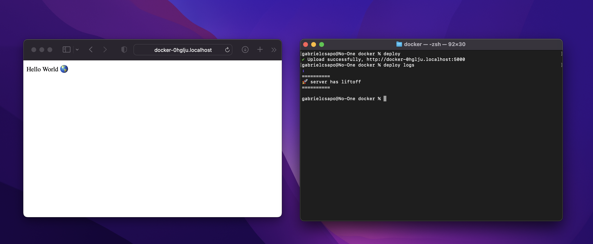

## Getting Started

Firstly we must install `deploy.sh`.

```bash
npm install deploy.sh -g
```

### What you'll need

- [Node.js](https://nodejs.org/en/download/) version 14 or above:
  - When installing Node.js, you are recommended to check all checkboxes related to dependencies.
- [Docker](https://docs.docker.com/get-docker/) is how deploy.sh runs and is required to start new applications
- [Mongo](https://docs.mongodb.com/manual/administration/install-community/) is required to store application state and logs

## Starting deploy.sh server

In order to deploy your applications you will need to spin up a deploy.sh server

```bash
deploy server
```

```bash
% deploy serve
✔ Started 0 deployment(s) successfully
⛅️ deploy.sh is running on port 5000
```

## Start your site

In order to do anything you must first go through the registration process by running:

```
deploy register
```

For this example I am going to use the folder in `examples/docker` in <https://github.com/gabrielcsapo/deploy.sh>.

```bash
deploy
```


To look at the logs from the docker container itself, simply run `deploy logs`

```bash
deploy logs
```


